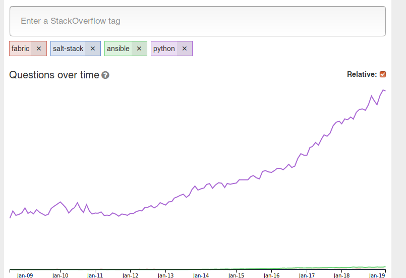

Yaml and Jinja for configuration management
===========================================

outdated text. See [February 2022](february-2022)

In 2013 we switched from shell scripts to fabric to do configuration
management.

fabric:

\> Fabric is a high level Python library designed to execute shell
commands remotely over SSH, yielding useful Python objects in return:

In 2014 we switched from farbric to salt-stack

I am not happy with salt-stack

http://sotagtrends.com/?tags=ansible+salt-stack+fabric


> width
> :   200
>
I am unsure if configuration management with yaml and jinja is a good
idea.

You can't debug it like ordinary code.

Salt swallows exceptions. This wastes my time. I am starting to hate it.

I want to move from salt to an other solution.

Ansible or terraform seem common these days.

I love python.

If I compare python with yaml+jinja, then python wins.

Back to fabric?

Fabric does not have the state based feature: Do x, only if x was not
done yet.

I like calling configuration management twice: First time a lot of
things get done, and on the second call I see something like "all states
are fine, nothing was changed, because everything was already the way it
should be".

I have no clue.

Feedback is welcome.

<http://sotagtrends.com/?tags=fabric+salt-stack+ansible+python>



> width
> :   200
>
Question:
<https://softwarerecs.stackexchange.com/questions/57922/configuration-management-based-on-python>
Configuration management based on Python

One reason I don't like YAML: There are way to many ways to write
mult-line strings. According to the up-votes a lot of other human beings
have the same issue. Too many choices, too much confusion, no
no-brainer. Don't blame the people, blame the context:
<https://stackoverflow.com/questions/3790454/in-yaml-how-do-i-break-a-string-over-multiple-lines>
Yes, there are several ways to write a multi-line string in python. But
it is very much simpler.

After thinking about this again, I know what I am missing: I am missing
a stacktrace if somethings goes wrong. In SaltStack all tasks which
should get done are a long flat list (after sls files an jinja got
evaluated). A single task can have two different relations to the
previous task: I can be just the next item in a list, or it can be
sub-task. This information gets lost. A stacktrace gives me a very good
road map. I am missing this road map in Salt (and I guess (but don't
know) other yaml and jinja based configuration management tools are the
same).

2019-08-23 today it is a nightmare again. If you know the programming
language python, then using SLS is way too complicated. At least for me.
Up to now we use salt-stack. Maybe ansible is better. But even there I
ask myself: why? A modern IDE like PyCharm is like flying. Overambitious
people could say: Yes, lets's implement auto-completion and other fancy
stuff for SLS files ..... but: Why? Why not keep it simple? With Python
I can declare a module-level variable and import this variable whereever
I want to. This somehow is possible with yaml+jinja, too, but it is not
simple, not nice, not easy. Grrrrr

Example: I have a sls file foo/bar.sls, which gets included in root/big.sls.
Since running all states takes
too long, I would like to call only foo/bar.sls. This is possible. But
one simple state from other/blu.sls is needed. Up to now I have no clue how to do this in salt-stack.
I could use "include" but this would include and **execute** all states. 
That's not what I want. Compared to python: I want to call
one method of a module, not every method of this module.


2019-09-16 this page is getting my "config management with yaml and jinja barf bag"

I wrote a custom module in python which gets used in the jinja+yaml mix.

I get this traceback. In most cases I love tracebacks, because they show me the root of the 
error. But in this case I see nothing. The lines of my code are not visible. This wasts valuable time. Gggggggggr

```
[ERROR   ] Rendering exception occurred
Traceback (most recent call last):
  File "/usr/lib/python2.7/site-packages/salt/utils/templates.py", line 169, in render_tmpl
    output = render_str(tmplstr, context, tmplpath)
  File "/usr/lib/python2.7/site-packages/salt/utils/templates.py", line 402, in render_jinja_tmpl
    buf=tmplstr)
SaltRenderError: Jinja variable 'unicode object' has no attribute 'foobar'
```

2019-12-10 today I get a meaningless error message again:

> Rendering SLS 'base:foo.absent' failed: Jinja variable 'str object' has no attribute 'stage'

Of course I will be able to fix it. But I don't like this. I prefer python stacktraces, because they
point me to the right direction. This YAML+Jinja feels like the clever idea from the past: XSLT. Since xml is everywhere,
we need to create a programming language with it. And to confuse everybody we say that xslt is not a programming language it is... I don't remember the matching term, and it does not matter. I don't like YAML+Jinja. I like Python and data in database systems. End of message.


# Alternativ: HCL (Hashicorp Configuration Language)

Terraform is getting more and more popular. They use a HCL which is basically JSON with comments:

https://www.terraform.io/docs/configuration/syntax.html

Looks better than YAML to me (my personal opinion)

# April 2020: back to imperative

Declarative vs imperative configuration management?

Declarative is the new and theoretical better approach.

Impertative is the old and pragmatic approach.

Declarative is great for updates: You define your desired result and some magic
engine configures your servers according to your wish.

But today "servers" get used less often. You use containers and containers don't get updated.

I think back to imperative makes sense.

# December 2021: Starlak

By chance I came across [Starlak](https://github.com/bazelbuild/starlark). A programming language for configuration. Created by google
for their build-system bazel.

Looks cool. Looks like Python.


# February 2022

I am learning Kubernetes. This means I need to embrace YAML. Kubernetes is cool. I stop looking for an alternative.

Kubernetes makes Configuration Management less important.

