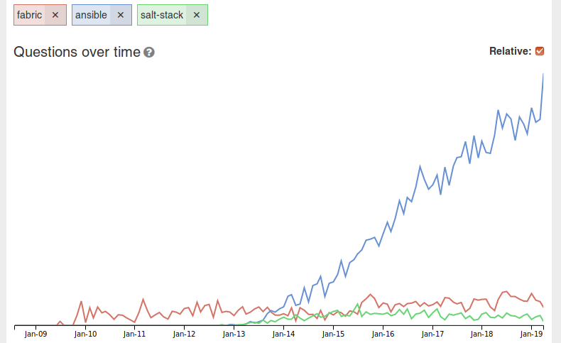

Yaml and Jinja for configuration management
===========================================

In 2013 we switched from shell scripts to fabric to do configuration management.

fabric:

> Fabric is a high level Python library designed to execute shell commands remotely over SSH, yielding useful Python objects in return:

In 2014 we switched from farbric to salt-stack

I am not happy with salt. 

http://sotagtrends.com/?tags=[fabric,ansible,salt-stack]

I am unsure if configuration management with yaml and jinja is a good idea.

You can't debug it like ordinary code.

